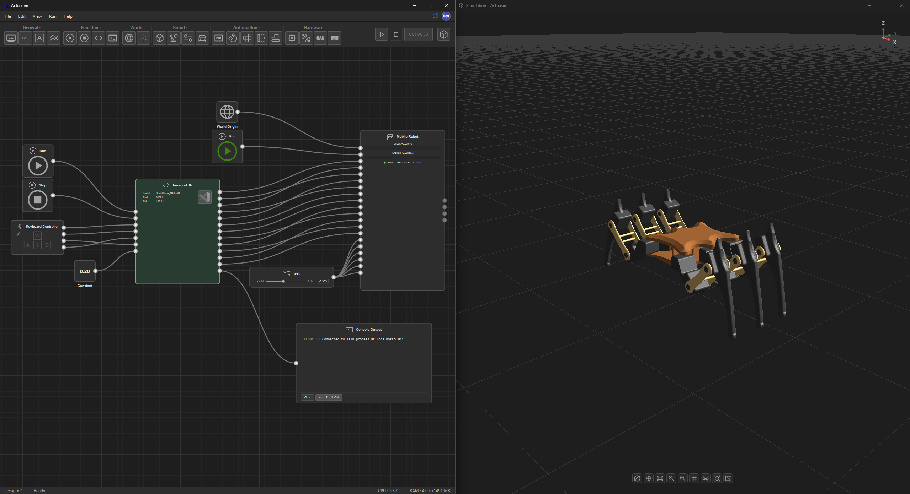

**A node-based simulation and control platform for robotics and automation.**

Actuasim lets you build, simulate, and control robotic systems visually, wiring together robot kinematics, physics, sensors, and control logic as a graph instead of hand-writing glue code for every project.

This repository is a **case study** for Actuasim. It contains just an overview of the system, architecture write-ups, and a running devlog of interesting problems encountered while building it. The application itself is closed-source and not available yet.

*This project initially started with a idea around end of November 2025 and still going on little by little.*

---

## What Actuasim Is

Actuasim is a visual programming environment purpose built for robotics simulation and control, currently under active development. Instead of stitching together separate tools for kinematics, physics simulation, sensor emulation, and control logic, Actuasim brings them into one node-based workspace:

- **Node graph editor** : build behavior by connecting typed nodes (robots, sensors, logic, PLC control nodes, ROS2 bridges) rather than writing scripts from scratch.
- **3D physics simulation** : a real-time viewport with configurable gravity, physics solver iterations; execution is controlled directly from each node wired into the graph, so different parts of a project can start and stop independently by enabling the parts that need runing.
- **Robot & mechanism modeling** : import URDF/XACRO-based robots and mechanical assemblies, including closed-loop mechanisms (four-bar linkages, pistons, coupled cranks) that plain URDF trees can't natively express.
- **Sensor emulation** : simulated cameras and LiDAR producing point-cloud and image data that flows through the same node graph as everything else.
- **Industrial control integration** : PLC-style control logic and ROS2 topic/service/bridge nodes, so simulated systems can be driven the same way real hardware would be.
- **Real hardware bridging** : connect the graph directly to microcontrollers (Arduino, Pico, STM32, ESP32), CAN bus, and IMUs, so a simulated pipeline can drive or read from physical devices.
- **Runs on ordinary hardware** : built to be usable on a normal laptop, not just a high-end workstation; see [Performance](docs/architecture/performance.md).

## In Action

This is a hexapod leg-mechanism project mid-run: on the left, the node graph; a `World Origin`, a `Keyboard Controller` feeding W/A/S/D input, a script node solving leg positions for each joint, and a `Mobile Robot` node rendering the kinematic for robot while rendering and solving physics for each tick with simulation world. On the right, the 3D viewport showing the same robot walking in real time. This whole simulation consume about `CPU: 5.3% · RAM: 4.6% (1491 MB)`, a six-legged walking robot, fully simulated with live keyboard teleoperation, still comfortably light on an ordinary machine.

## How It Works

A typical project follows the same shape as the example above:

1. **Define the world** A `World Origin` (or more generally, [World nodes](docs/architecture/node-types.md)) anchors every other transform in the scene.
2. **Bring in a robot or mechanism** Import a URDF/XACRO-based assembly, see [Kinematics](docs/architecture/kinematics.md) for how forward/inverse kinematics work for ordinary arms and legs, and how mechanisms with loops (linkages, pistons) get resolved into something the solver can actually work with. Complex kinematics, like solving six independently-moving legs, can run as its own process that the graph node talks to over a local connection at a fixed rate, keeping heavy math off the graph's own execution.
3. **Wire up control** Drive it from a `Keyboard Controller` for manual teleoperation, a `PLC Controller` node for control-logic testing, a ROS2 topic/service node to hook into an existing stack, or a scripted/recorded input for repeatable tests.
4. **Read state back out** Robot nodes report their own state (velocity, grounded/contact flags, joint positions) as typed output ports; the same graph that drives the robot is what you inspect to understand what it's doing, no separate debugger needed.
5. **Watch it in the viewport** The [3D simulation window](docs/architecture/simulation-space.md) reflects exactly what the [physics pipeline](docs/architecture/physics-collision-pipeline.md) is computing, updated at the same rate the graph runs.

Every node and port along the way is self-documenting in the app; see the [Node Types](docs/architecture/node-types.md) and [Port Types](docs/architecture/port-types.md) references for what that actually looks like, and [Workspace & UI](docs/architecture/workspace-ui.md) / [Simulation Space](docs/architecture/simulation-space.md) for the windows themselves.

## Use Cases

- **Legged & mobile robot gait development** : prototype and tune walking/driving behavior against real physics before it touches hardware.
- **Teleoperation & control testing** : drive a simulated robot manually (keyboard, or any input node) to validate control logic feels right before wiring it to a real controller.
- **Mechanism validation** : check that a closed-loop mechanism (a linkage, a piston-driven assembly) actually moves the way the CAD design intends, using the same master/mimic-joint model the physical build will need.
- **Control-system integration testing** : exercise PLC-style control logic or a ROS2-based stack against a simulated plant instead of risking it on real actuators first.
- **Sensor pipeline development** : build and debug camera/LiDAR-consuming logic against a simulated sensor feed, without needing the physical sensor or scene available.

## Who It's For

Anyone who want to prototype and validate mechanism behavior, control logic, and sensor pipelines before touching real hardware.

## Documentation

- [`docs/architecture/`](docs/architecture/00-overview.md) : how the major subsystems fit together, including the node/port catalogs, workspace layout, and performance philosophy
- [`docs/devlog/`](docs/devlog/) : notes from building specific pieces of the system (not a complete day to day log)
- [`docs/design-principles.md`](docs/design-principles.md) : the philosophy guiding design decisions

## A Note on Scope

This repository is intentionally documentation only. No implementation code, build files or internal tooling are included or referenced here; the goal is to give an honest picture of what Actuasim does and how it's built.

## License

See [`LICENSE`](LICENSE). All rights to the Actuasim application are reserved; documentation in this repository may be read and shared but not reproduced for commercial purposes without permission.
