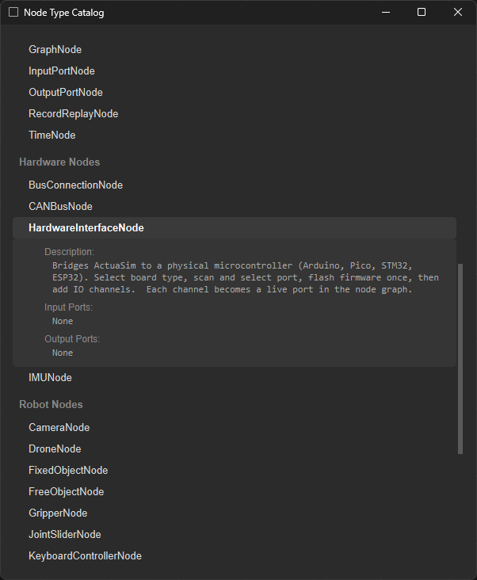

# Node Types

Actuasim ships with a large and growing set of node types 50+ across the categories introduced in the [Node Graph Engine](node-graph-engine.md) doc, and counting. Every node is self-documenting: selecting one in the in-app catalog browser shows its description, inputs, and outputs directly, which is also the pattern this page follows.

## How a Node Documents Itself

Every node exposes the same four things; here's `HardwareInterfaceNode`, shown in the screenshot at the bottom of this page exactly as the app presents it:

> **HardwareInterfaceNode**
> **Description:** Bridges Actuasim to a physical microcontroller (Arduino, Pico, STM32, ESP32). Select board type, scan and select port, flash firmware once, then add IO channels. Each channel becomes a live port in the node graph.
> **Input Ports:** None
> **Output Ports:** None

That last part is worth noting: a node's port list isn't always fixed at design time. `HardwareInterfaceNode` starts with zero ports, its whole job is to let you configure a physical board and have each IO channel you add turn into a real, typed port on the node, live in the graph. That's a deliberate pattern: rather than pre defining every possible pin as a port, hardware-facing nodes grow the ports they actually need.

For every other node, "goal / inputs / outputs" is the same lens to read them through:

- **Goal** : what the node is *for*, in one sentence
- **Inputs** : what it needs from upstream to do that
- **Outputs** : what it hands to the rest of the graph

## Types by Category

The full set, organized the same way the in-app toolbar and catalog group them, six categories, 54 node types as of this writing.

### General

Core utility, display, and graph-structuring nodes. Not tied to a robotics domain.

| Node | Goal |
|---|---|
| `CameraViewerNode` | Displays a `CameraNode`'s image feed inline in the graph |
| `ConstantValueNode` | Emits a fixed, user-set value on its output |
| `DisplayTextNode` | Shows a text/value readout directly in the graph, for quick inspection |
| `GraphNode` | Encapsulates a subgraph as a single reusable node, the way a subroutine wraps a block of logic |
| `InputPortNode` / `OutputPortNode` | Define the exposed input or inputs to a variable and pick it up from somewhere else in node workspace (Alternative for long connection line) |
| `RecordReplayNode` | Captures port values over time and can play a recorded session back into the graph |
| `TimeNode` | Emits simulation time / elapsed time as a signal other nodes can consume |

### Function

Calculations, logic, and signal shaping, plus execution control.

| Node | Goal |
|---|---|
| `ArithmeticNode` | Performs a math operation (add, subtract, multiply, etc.) on its inputs |
| `ButtonNode` | A manual, clickable trigger a user can fire by hand |
| `ComparatorNode` | Compares two inputs and outputs a boolean result |
| `ConsoleOutputNode` | Prints incoming values/messages to a console log |
| `DebounceNode` | Filters out rapid, noisy signal changes so only a stable value passes through |
| `EdgeDetectorNode` | Fires on a rising or falling transition of a boolean input |
| `MathEquationNode` | Evaluates a user-defined mathematical expression |
| `PIDNode` | A PID controller for closed-loop control |
| `RunNode` | A manual, clickable trigger user can fire, labeled as RUN |
| `ScriptNode` | Bridges to an python script/process for custom logic, wire into inputs and outputs in nodes as define in script |
| `StopNode` | A manual, clickable trigger user can fire, labeled as STOP |
| `ThresholdNode` | Outputs a boolean based on whether an input crosses a set value |

### World

Coordinate systems and static scene setup.

| Node | Goal |
|---|---|
| `WorldFrameNode` | Defines the global coordinate of origin or center of simulation space project |
| `OffsetFrameNode` | A coordinate frame offset from another frame |

### Robot

Robot bodies, actuators, sensors, and physical objects.

| Node | Goal |
|---|---|
| `CameraNode` | Simulated camera; outputs an image feed from simulation space |
| `FixedObjectNode` | A static scene object that physics doesn't move |
| `FreeObjectNode` | A dynamic rigid body, free to be acted on by gravity and contacts |
| `GripperNode` | A gripper end-effector, open/close control and contact state |
| `JointSliderNode` | A manual UI control for driving a single joint directly, mainly for testing |
| `KeyboardControllerNode` | Routes keyboard input (WASD or arrows) into the graph as control signals, for teleoperation |
| `LidarNode` | Simulated LiDAR sensor; outputs a point cloud |
| `MobileRobotNode` | A wheeled/legged mobile robot body, reporting each given joint state and ground-contact state with applied physics |
| `MountSelectorNode` | Selects a mounting point/frame on a robot joint for attaching another part |
| `PointCloudPlaybackNode` | Replays a previously recorded point-cloud capture or record with given frame and point-cloud |
| `PositionNode` | Outputs a position value |
| `RobotArmNode` | An articulated robot arm body |
| `ROS2BridgeNode` | A generic bridge between the graph and a ROS2 system |
| `ROS2ServiceNode` | Calls or serves a ROS2 service through ROS2Bridge |
| `ROS2TopicNode` | Publishes or subscribes to a ROS2 topic through ROS2Bridge |
| `VelocityControlNode` | Commands a robot's linear/angular velocity, and or limit them |
| `WaypointsNode` | Defines a sequence of positions/poses for a robot to follow |

### Automation

Control-system and industrial-automation building blocks.

| Node | Goal |
|---|---|
| `AssemblyNode` | Represents an imported mechanical assembly; links, joints, mimic relationships (see [Kinematics](kinematics.md#closed-loop-mechanisms)) |
| `ContinuousActuatorNode` | Models an actuator that moves continuously, e.g. a motor or drive |
| `ConveyorNode` | Models a conveyor belt moving parts along its length of given surface |
| `DiscreteActuatorNode` | Models an actuator with discrete states, e.g. on/off or extend/retract |
| `InputExpanderNode` | Shrink 8 individual inputs to 8-bit PLC input |
| `LatchNode` | Holds a signal state until explicitly reset |
| `OutputExpanderNode` | Extend PLC 8-bit output to 8 individual outputs |
| `PartFeederNode` | Spawns/feeds simulated parts into a scene, e.g. for a production-line scenario |
| `PLCControllerNode` | Runs PLC-style control logic against the rest of the graph |
| `ProximitySensorNode` | Detects nearby objects within a set range |

### Hardware

Bridges between the simulated graph and physical devices.

| Node | Goal |
|---|---|
| `HardwareInterfaceNode` | Bridges to a physical microcontroller (Arduino, Pico, STM32, ESP32); flashes firmware and exposes configured IO channels as live ports |
| `BusConnectionNode` | Represents a shared communication bus other hardware nodes attach to |
| `CANBusNode` | Interfaces with CAN-bus-connected hardware and protocols |
| `IMUNode` | Reads orientation / acceleration / angular velocity from an inertial measurement unit |

---

See [Port Types](port-types.md) for what actually flows between these nodes, and [Workspace & UI](workspace-ui.md) for where the catalog lives in the app.

## In the App

Example of the in-app node catalog browser; useful and quick access reference for what nodes available, description and input/outputs.
