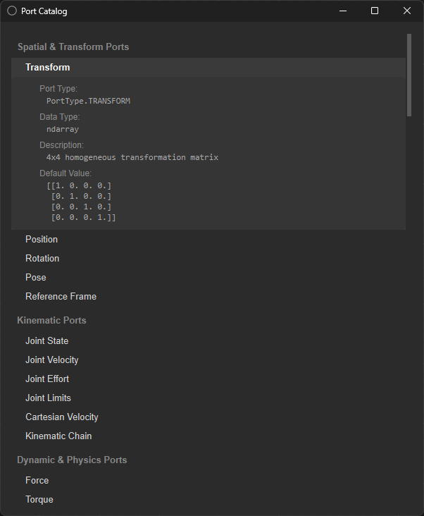

# Port Types

Ports are the typed endpoints that make the node graph safe to wire together; a connection is only valid if the output port's type and the input port's type agree. Like nodes, ports are self-documenting in the app: each port type has a browsable entry showing exactly what it is.

## How a Port Documents Itself

Every port type exposes the same four fields; here's `Transform`, shown in the screenshot at the bottom of this page exactly as the app presents it:

|**Transform**||
|---|---|
| **Port Type:** | `PortType.TRANSFORM` |
| **Data Type:** | `ndarray` |
| **Description:** | 4×4 homogeneous transformation matrix |
| **Default Value:** | the 4×4 identity matrix |

That's the general shape for every port type: a stable type identifier (what the connection compatibility check actually compares), the underlying data representation, a plain language description, and a sane default so a newly-added node isn't left with garbage on an unconnected input.

## Port Families

Ports are grouped by what kind of information they carry or how they relate to each other. The application currently defines a number of port types, but not all of them are assigned yet some exist for future use. Because several of these share the same underlying data type under different port names, a basic type like `Float`, `Int`, or `Bool` can end up representing very different things depending on which port it's attached to.

## Why This Level of Typing

A generic "number" or "object" port would let you wire a joint velocity into a force input without complaint; technically connected, semantically meaningless. Splitting ports by what they actually represent turns that class of mistake into something the graph itself rejects at connection time, rather than something that silently produces wrong behavior at runtime.

---

See [Node Graph Engine](node-graph-engine.md#ports-and-typing) for the connection rules these types are checked against, and [Node Types](node-types.md) for which nodes produce and consume them.

## In the App

Example of the in-app port catalog browser; useful as a reference for what ports available and how data structured on each data transfer.
