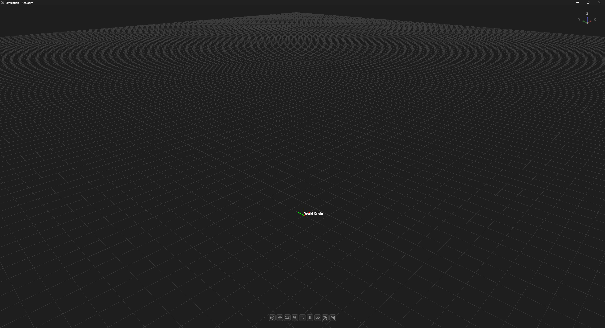

# Simulation Space

The simulation viewport is where a project's node graph stops being a wiring diagram and becomes a physical scene, a dedicated 3D window, separate from the [graph editor](workspace-ui.md), showing exactly what the 3D and [physics pipeline](physics-collision-pipeline.md) is computing.

## What's in the Viewport

- **Ground grid** : an infinite reference plane extending to the horizon, giving scale and orientation before any geometry is added. same grid works as virtual floor.
- **World Origin gizmo** : the coordinate frame for every other transform in the scene is ultimately expressed relative to world origin. (see [World nodes](node-types.md) and the `Reference Frame` port in [Port Types](port-types.md)).
- **Orientation indicator** (top-right) : a compact axis readout so it's always obvious which way is which while orbiting the camera.
- **Viewport toolbar** (bottom) : navigation and inspection tools: camera controls(orbit, pan and zoom with reset view option), hide ground grid if needed, show or hide scene frames or 3D mesh object in the scene; kept as a minimal overlay rather than a full toolbar competing with the 3D view for attention.

## An Empty Scene Is a Deliberate State

The screenshot above is a freshly-opened simulation; no objects, nothing placed yet. That's intentional as a starting point: the viewport doesn't assume a default robot or scene. Everything visible in a real project; robot bodies, fixed and free objects, cameras, LiDAR is something a node in the workspace put there, which keeps the 3D view an honest reflection of the project rather than a separate thing to keep in sync with it.

## Relationship to the Workspace

Nothing in the viewport is simulated independently of the node graph, a `FixedObjectNode` or `FreeObjectNode` in the graph is what puts a body in this space, a `CameraNode` is what gives you a rendered feed of it, and the [physics pipeline](physics-collision-pipeline.md#simulation-loop) is what moves it once the simulation is running. The viewport is a *view* of simulation state, not a second place where state lives.

---

See [Physics & Collision Pipeline](physics-collision-pipeline.md) for what actually drives motion in this space, and [Performance](performance.md) for how viewport rendering is kept independent of simulation fidelity.
