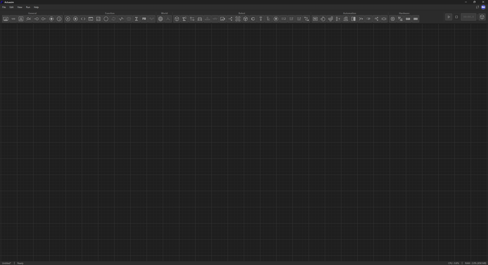

# Workspace & UI

Actuasim is a multi-window desktop application: the node graph editor (the main workspace) and the [3D simulation viewport](simulation-space.md) are separate windows, so you can lay them out side by side, on separate monitors, or however suits the project at hand.

## The Main Workspace

The main window is built around the node graph, with everything else arranged to stay out of its way:

- **Menu bar** : `File`, `Edit`, `View`, `Run`, `Help`, plus update checker and user account in the top-right corner.
- **Categorized toolbar** : the nodes surfaced directly with groups labeled *General*, *Function*, *World*, *Robot*, *Automation*, and *Hardware*. All added and running nodes will appear withing the groups.
- **Canvas** : a large, gridded, pannable/zoomable surface where nodes can be placed and wired. Empty by default — everything on it is something the project explicitly put there.
- **Status bar** : bottom of the window: the current projects's name and save state (e.g. `Untitled*` with an asterisk meaning unsaved changes), a status message (`Ready`), and live **CPU and RAM usage** for the application itself.

That last item; CPU/RAM shown directly in the status bar, always visible and reflects a deliberate performance stance; see [Performance](performance.md) 

## Layout Philosophy

The workspace doesn't try to cram the 3D view, the graph, and every inspector panel into one window. Splitting the graph editor from the simulation viewport means each can be sized for what it's actually used for a wide canvas for wiring a complex graph, a full-window 3D view for watching a mechanism move without either fighting the other for space.

---

See [Simulation Space](simulation-space.md) for the companion 3D viewport window, and [Node Graph Engine](node-graph-engine.md) for what's actually happening on the canvas once nodes are wired together.