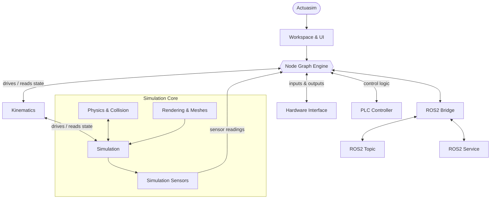

# Design Principles

Notes on the philosophy behind Actuasim's design decisions, collected as they come up, not written as a manifesto up front.

## Consolidation Over Proliferation

When a new capability is needed, the default question is "can this be expressed with what already exists?" before "what new node/type/mechanism do we add?" A typed port system and a handful of chosen node categories go further than a large catalog of narrow, single purpose nodes that all do almost the same thing. Fewer, more composable primitives are easier to learn, easier to keep consistent, and cheaper to maintain than many overlapping ones.

This shows up concretely in things like closed-loop kinematics: rather than inventing a bespoke "constrained mechanism" node type, closed loops are expressed using the same mimic-joint mechanism already needed for simpler master/slave relationships (see [Kinematics](architecture/kinematics.md)).

## The Graph Is the Source of Truth

There's no hidden compiled form of a project that diverges from what's shown in the editor. What you see wired together is what executes. This makes debugging tractable; if behavior is wrong, the graph itself is where to look, not a generated intermediate representation.

## Control Flow Is Part of the Graph

Starting and stopping a simulation isn't a separate, application-level concept; it's expressed the same way everything else is, as `Run` and `Stop` nodes wired into the graph (see [Physics & Collision Pipeline](architecture/physics-collision-pipeline.md#running-the-graph)). A project can start one subsystem while another stays idle, because "running" is just another thing a node does, not a mode the whole application switches into. It's the same idea as "everything is a node" applied to execution itself, rather than carving out a special control panel that sits outside the graph model everything else uses.

# Architecture

This document is a bird's-eye view of how Actuasim's pieces fit together and what the application can actually do — not a deep dive into any one subsystem. Each subsystem below links out to its own doc for the details.

## The Big Picture

`Node Graph Engine` is the hub everything else hangs off of, it's what the Workspace builds and edits, and it's what eventually gets saved.

## What Actuasim Can Do

- **Build behavior visually** : Wire together robots, sensors, math/logic, and control nodes on a typed graph instead of writing glue code per project.
- **Simulate physics in real time** : Gravity, contacts, and constraints run continuously, driving whatever's in the scene.
- **Model robots and mechanisms** : Robot arms, mobile robots, and imported CAD assemblies, including ones whose real-world motion isn't a simple tree of independently actuated joints are all handled through the same kinematics model.
- **Let robots interact with objects** : Moving, crashing things as part of the physics simulation, not as a scripted animation.
- **Sense the environment** : Proximity, camera, and LiDAR sensors feed real data back into the graph.
- **Talk to the real world** : Drive or be driven by physical hardware (microcontrollers, CAN, IMUs), a ROS2 stack, or PLC-style control logic, using the same graph as everything else.
- **Watch it happen** : A dedicated 3D viewport (Simulation) reflects exactly what the graph and physics pipeline are computing.
- **Run on hardware you already have** : Built with ordinary laptops in mind, not a workstation baseline.

## Subsystems

| Subsystem | What it does |
|---|---|
| [Workspace & UI](workspace-ui.md) | The main editor window; toolbar, canvas, status bar |
| [Node Graph Engine](node-graph-engine.md) | The typed node/port graph that defines everything a project does |
| [Node Types](node-types.md) | The full catalog of node types available |
| [Port Types](port-types.md) | The typed connections between nodes |
| [Physics & Collision Pipeline](physics-collision-pipeline.md) | Steps the simulated world forward; gravity, contacts, constraints |
| [Kinematics](kinematics.md) | Forward/inverse kinematics for arms and mobile robots, plus closed-loop mechanisms |
| [Sensors](lidar-sensor-system.md) | Simulated proximity, camera, and LiDAR sensing against the physics world |
| Real-World Integration | Bridges to physical hardware, ROS2, and PLC-style control logic |
| [Simulation Space](simulation-space.md) | The 3D viewport a project's physics plays out in |
| [Rendering & Viewport](rendering-viewport.md) | Real-time visualization of what the graph is doing |
| [Performance](performance.md) | Why it's built to run well on ordinary hardware |
| [Data Formats](data-formats.md) | How projects, robots, sessions, and sensor captures are saved |

## Design Threads That Run Through All of It

- **Everything is a node** : Robots, sensors, control logic, and real-world bridges are all nodes on the same graph, connected through typed ports, there's no hidden control panel or scripting layer bolted on the side.
- **The graph is the source of truth** : What you see in the editor is what runs.
- **Real-world integration is just more graph** : A hardware bridge or a ROS2 node isn't special-cased plumbing, it wires in exactly like any other node, into exactly the port it needs to.
- **Complex mechanisms don't need to be hand-rigged** : Robots and mechanisms that don't reduce to a simple tree of joints are still handled through the ordinary kinematics model, see [Kinematics](kinematics.md) for how.

See [`design principles`](../design-principles.md) for the philosophy behind these choices, and [`docs/devlog/`](../devlog/) for the war stories behind specific subsystems.

## Separate Concerns That Change at Different Rates

Rendering fidelity and physics fidelity are independent settings, not coupled through a single "quality" slider, a project might need accurate contacts but doesn't need shadows, or vice versa. Similarly, robot descriptions, session recordings, and sensor captures are three separate file formats (see [Data Formats](architecture/data-formats.md)) rather than one project file, because they're edited, shared, and versioned on different timelines.

---

These aren't fixed rules so much as defaults that get revisited when they stop earning their keep. see [`docs/devlog/`](devlog/) for cases where a specific design got reworked.